# Football ( Soccer ) Visualisations #
Football ( Soccer ) plots created using ggplot2

## Premier League 2019/20 - 'Top 4' Race [June 24th, 2020] ##

The Top four race in the Premier League is so close. It is almost as if none of them want to finish in the top 4. Whenever one team has won, the other teams involved in the race have won. Whenever one team lost, the other team has lost, failing to take advantage of the situa

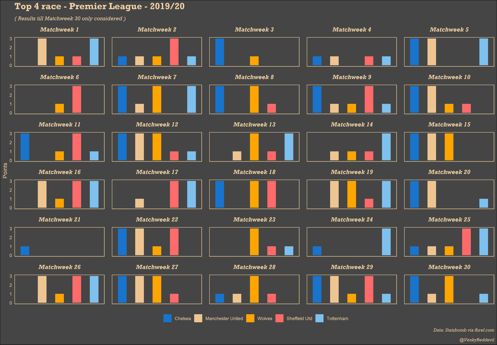

## Premier League Teams 2019/20 - Squad Age Profile [June 29th, 2020] ##

There have been some interesting young players to watch out for in the season so far. Some teams like Crystal Palace have struck with experienced players through out the season. However, Teams like Manchester United & Manchester City have had a mix of youth and experience. Manchester United's squad is in fact the youngest in the league in terms of average age

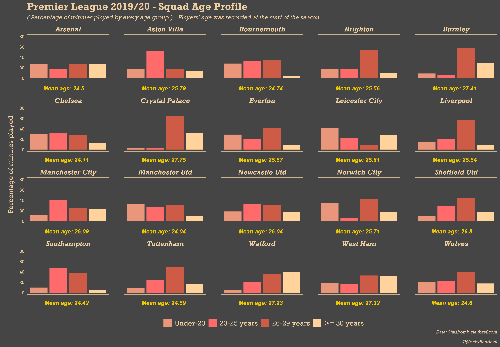

## Premier League 2019/20 - % of pressures applied in different thirds of the pitch by each team [July 2nd, 2020] ##

Manchester City, Liverpool leading the way for most % of pressures in the Attacking third. Newcastle United and Crystal Palace the complete opposite.

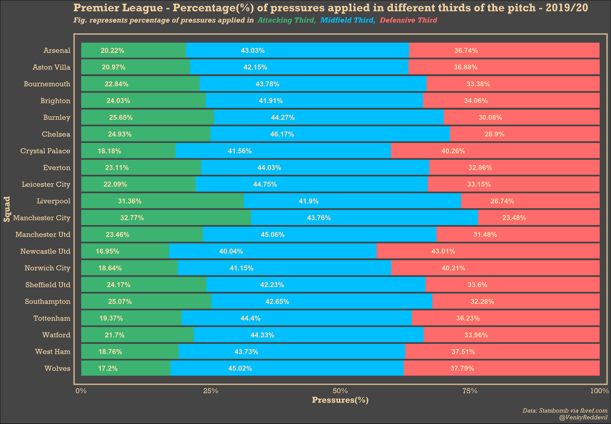

## Manchester United 19/20 - Goals Scored & Conceded during different phases of the game [August 19th, 2020] ##

Manchester United in the 19/20 season have conceded late goals drawing games, mostly, as a result. Sometimes failed to score more than 1. Sometimes scored to
comeback. Here is how they farred during different phases of the game.

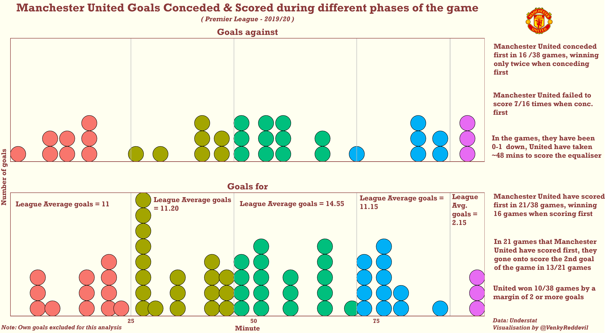

## How does the Match State affect Ole Gunnar Solskjaer's substitutions? [Feb 9th, 2021] ##

Ole Gunnar Solskjaer was known to make some delayed substitutions in 2019/20. I tried to analyse how much has he changed in that aspect in 2020/21. Was that any truths to some of the myths in that topic. You can read the full analysis [here](https://twitter.com/VenkyReddevil/status/1359131984996405254?s=20).

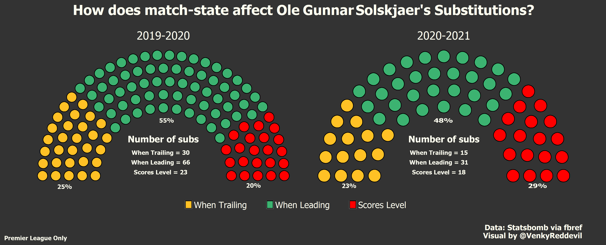

## Which Manchester United players are consistent in front of goal? [Feb 12th, 2021] ##

Manchester United have largely been dependent on Bruno Fernandes for goals but how do the other players fare. Which players score regularly and which players
do not?

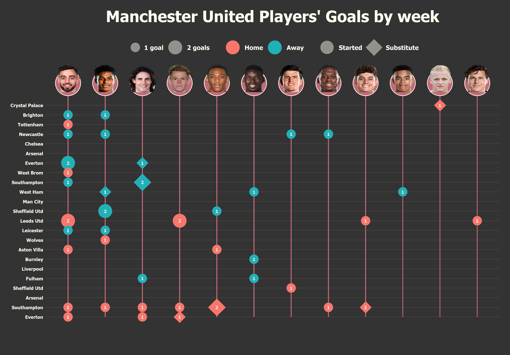

## The Premier League Form Table 2020/21 [March 15th, 2021] ##

Not a lot of teams picked for best form this season. There have been a lot of upsets including Aston Villa beating Liverpool 7-2, Manchester United losing to Sheffiled United, Leicester City beating Manchester City 5-2. However, if there is one team that can be picked for form , it is Manchester City, as shown in the visual below

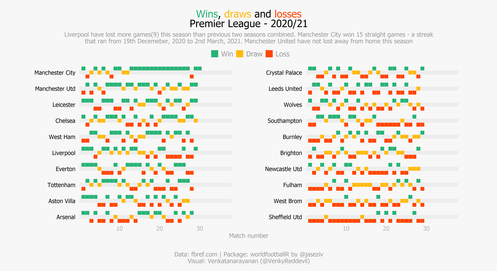

## Manchester United PL 2020/21: Shots For and Against [Feb 11th, 2021] ##

This is called a waffle plot. It shows the number of shots for and against Manchester United along with the different outcomes as indicated by the different colors

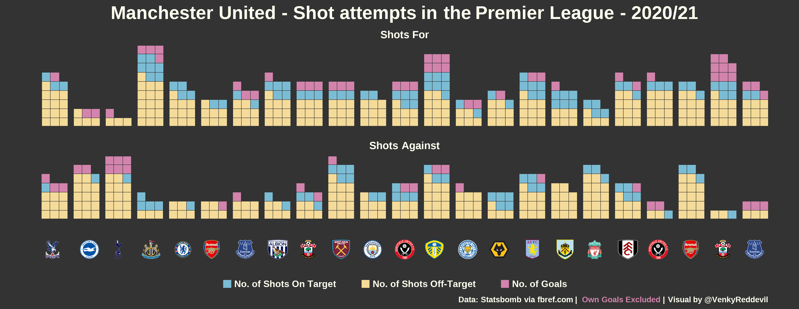

## Premier League 2020/21 - % of Home and Away wins [March 17th, 2021] ##

The Premier League 2020/21 season has been very weird so far with Liverpool deciding to start their losing streak at Anfield, Manchester United struggling at home. Not just that a lot of teams including Everton, Wolves, Leciester City have struggled to home. Here is a visual showing the % of each team's wins at home and away.

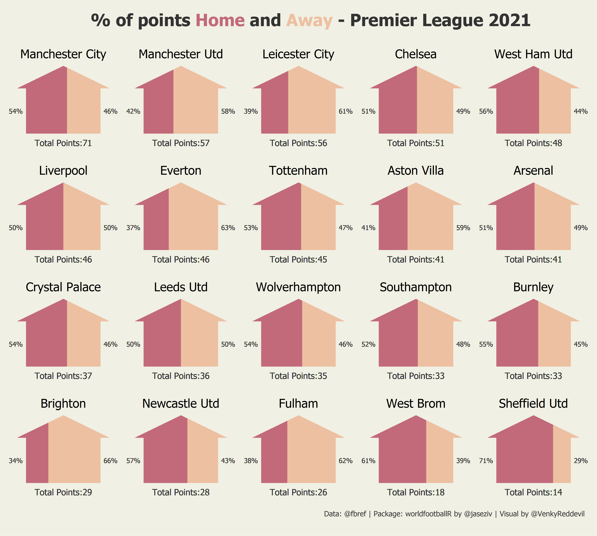

## The EFL Championship Playoff Race 2020/21 [April 13th, 2021] ##

The top two spots in the EFL Championship are pretty much confirmed. However, the race for the playoff spots is still and one team out of the five is going to be left behind. Barnsely's rise to where they are now has been incredible.

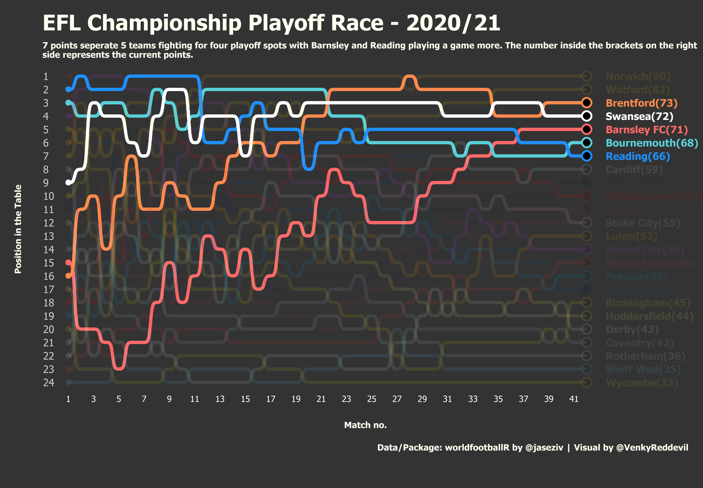

## Chelsea Players: % of minutes under Tuchel vs Lampard [April 19th, 2021] ##

Chelsea had change of managers halfway through the season. This Visual gives an idea of the players preferred by the each manager. For example, Tammy Abraham preffered by Frank Lampard but was completely sidelined by the German manager.

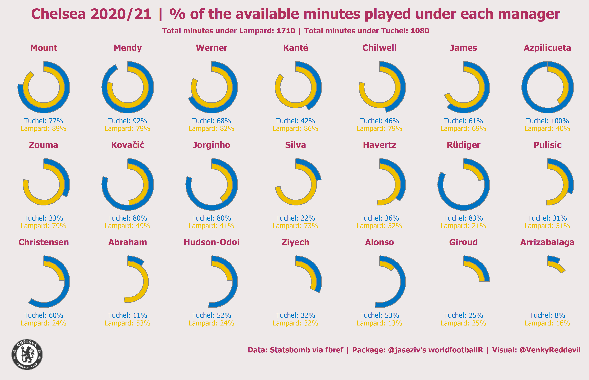

## Who will win the Premier League 2020/21 Golden Race? [April 24th, 2021] ##

Harry Kane looks set to have another excellent individual season with the Tottenham captain on track to win another golden boot. Salah, as well, has silently having another excellent season and is closest to Salah. Bruno Fernandes comes third in his first full season for Manchester United. Patrick Bamford too is involved in the race proving his doubters from the start of the season wrong. 

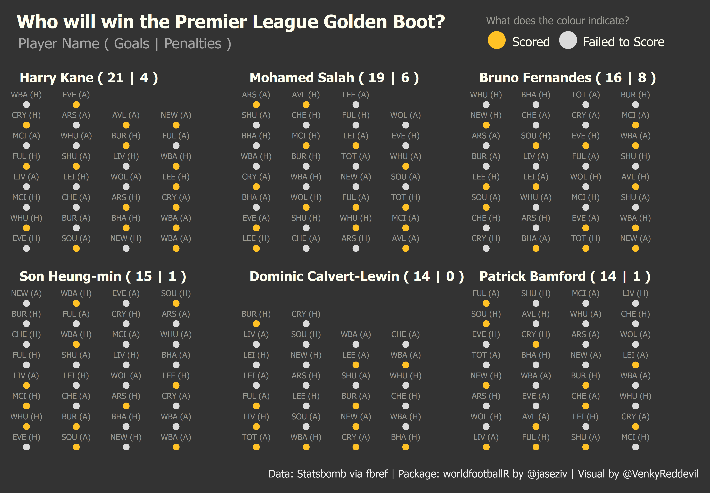

## How did the teams from the EFL Championship split the mintues across different age groups? [May 17th, 2021] ##

The EFL Championship is known for producing some amazing young talents. This did not change in the 2020/21 season. On a sidenote, the things that Barnsley have acheieved with such a young squad is another reason why they deserved all those praise.

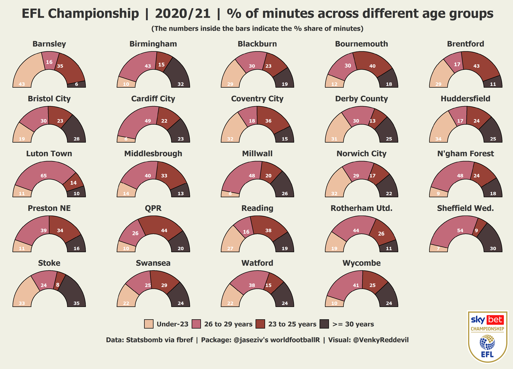

## EFL Championship 2020/21 - % of Home and Away wins [March 19th, 2021] ##

Looking at how the EFL Championship teams fared home and away, I created this visual inspired from [Charlie Gallagher](Premier League 2020/21 - % of Home and Away wins [March 17th, 2021])'s #tidytuesday [viz](https://github.com/charlie-gallagher/tidy-tuesday/tree/master/kenya).

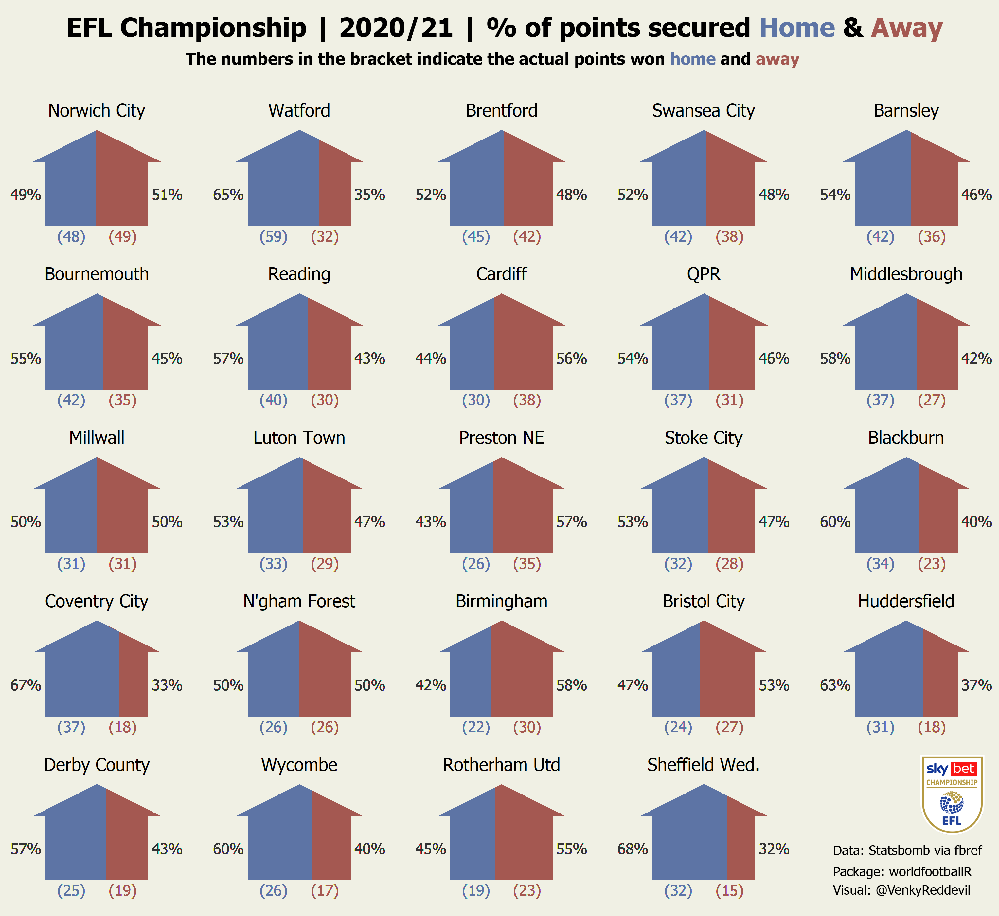

